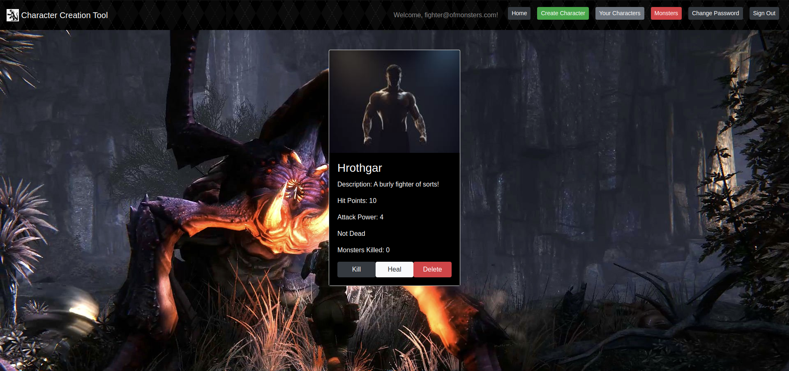
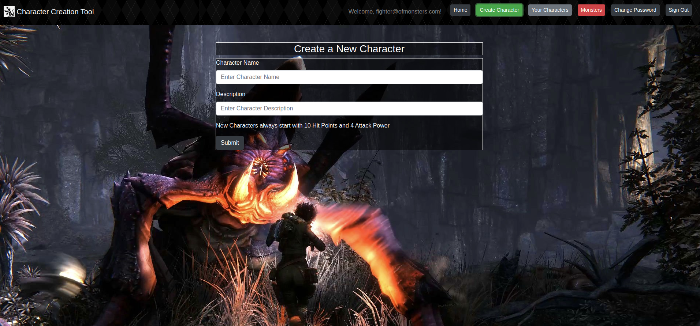
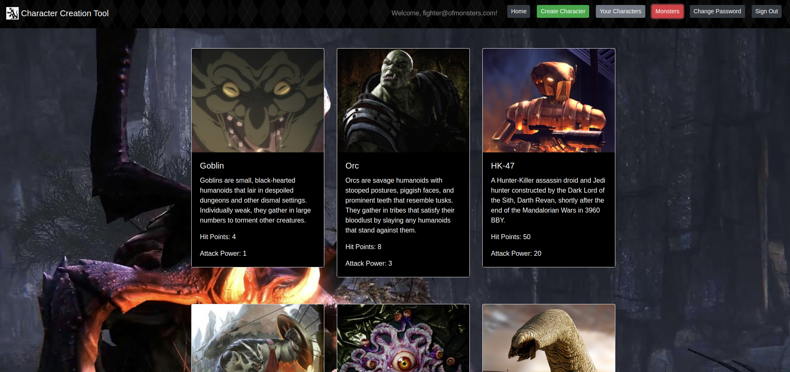
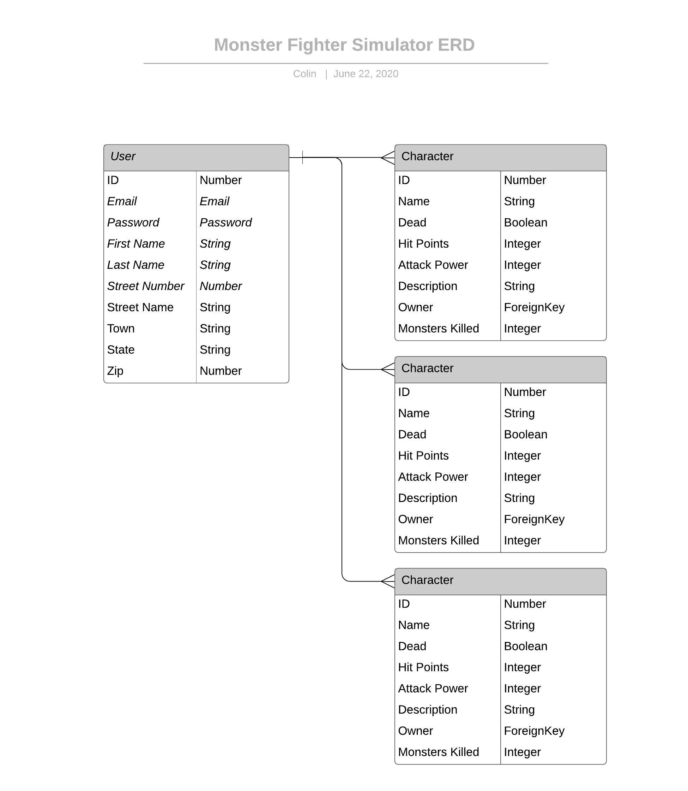
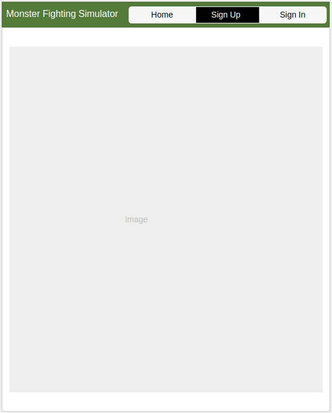
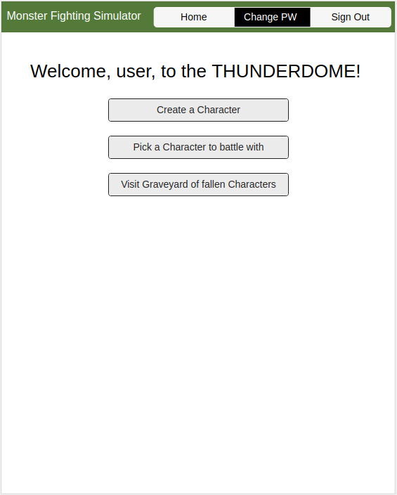
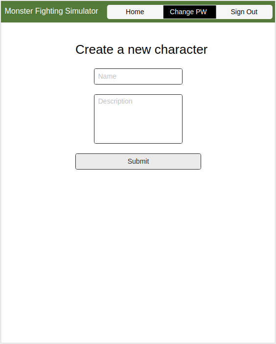
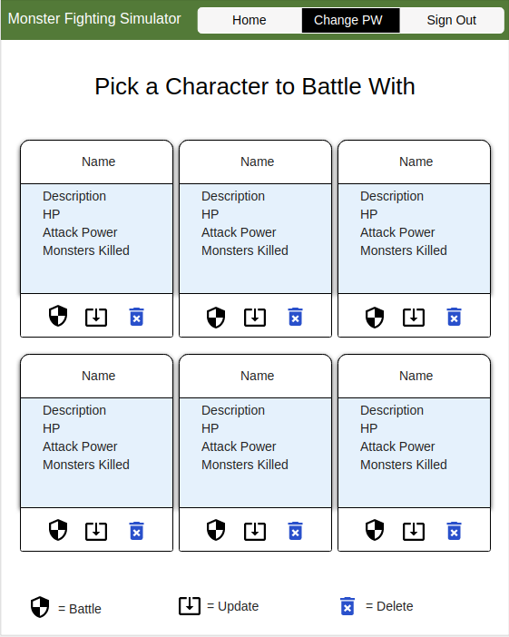
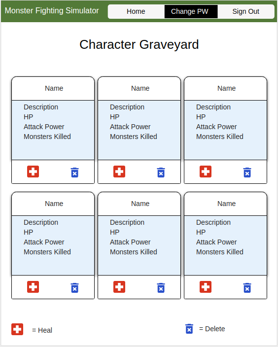
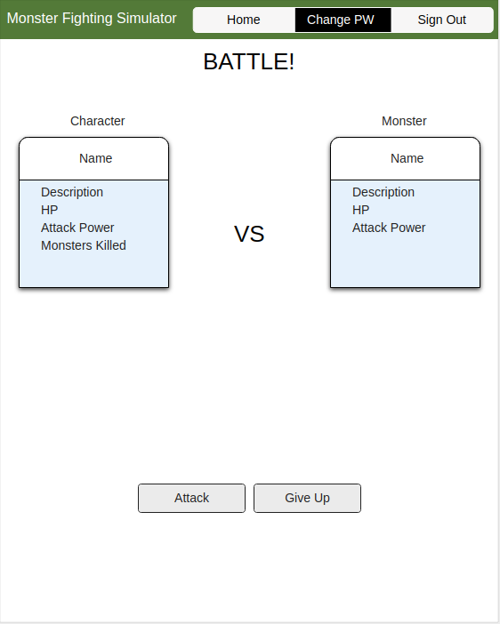

# Character Creation Tool Client

This is the capstone project of my time at General Assembly. I wanted to push myself and really make use of all of the different tools that we had been taught. This is why I am incorporating a React front-end built with Javascript to a Django back-end built with Python (which incorporating those two together was a lot harder than I had initially realized).

This project is a simple character creation tool that also tracks if a character is alive or dead, and can revive them if they are dead. I wanted to create an application which I would want to use and be able to show to friends and have them enjoy it.

Working within the scope of time (4 days) there was a lot more which I had wished to accomplish and still may in later iterations of the project. Originally (and you will see in ERD/Wireframes below) I had wanted to flesh a full Monster Fighting Simulator. While this did not fully come to fruition the foundation is there to build from in the future.

## Important Links

- [Character Creation Tool API Repo](https://github.com/brinecr/Character-Creation-Tool-API)
- [Deployed API](https://character-creation-tool.herokuapp.com/)
- [Deployed Client](https://brinecr.github.io/Character-Creation-Tool-Client/#/)

## Planning Story

The first thing I took time to do was really figure out what I wanted to accomplish with this project.

I then put together a tentative schedule

1. Monday: Back End Complete + Auth + as much documentation that I can
1. Tuesday: Front-End
1. Wednesday: Front-End (make sure front end is talking to back end properly)
1.Thursday: Make things pretty, clean things up (SCSS, CSS), add extra functionality (more monsters, other attributes to characters)

### User Stories

1. As an unregistered user i want to be able to sign up for an account.
1. As a user I would like to be able to create characters!
1. As a user I would like to make my characters battle monsters!
1. As a user I would love to see some power-ups available while battling monsters!
1. As a user I would love to track how well my characters have done!
1. As a user I would love to be able to revive my characters from the dead!
1. As a user I want to be able log into my account
1. As a user I want to be able to sign out
1. As a user I want to be able to change my password

### Technologies Used

1. html
1. CSS / sass
1. JavaScript
1. React
1. Bootstrap
1. Axios
1. AJAX
1. Requiring other files
1. Wireframes
1. User Stories
1. Markup documentation
1. Use of NPM
1. GitHub Integration w/ branch control
1. Integration with a custom API I created with Django/Python

### Unsolved Problems

I see this project as the base of a game where you can take these characters and their statistics and then do more with them.

Originally I had wanted to implement a monster fighting simulator as the program I was going for - but had to adjust my scope during the process so I decided to make it into a character creation tool with what I had already built. The idea behind the monster fighting element I would have been able to battle characters against pre-defined monsters (and maybe even let players define some in the future).

Taking these basic tools as a combat system I could also flesh out a world to have a character walk around - I like to think of the original Final Fantasy game as a lot of inspiration there as "what could be."

On the front end I could always add more functionality, in the future, to interact with the back end. If we needed to show more statistics or have different parts of the project interact with each other. Also adding battle portions to have the characters fight monsters. There are so many little things I'd love to add to this project as gaming is a hobby of mine.

## Images

---
### Application Screenshots

### ERD (entity relationship diagram)

#### Wireframe:

### Set Up and Installation Instructions

Please see API instructions as well - both the back end API and Front End application need to be loaded and running for the front end to work.

If you choose to fork/clone this repo please follow these instructions to make sure it is working correctly:
1. Fork the Repository
2. Clone the Repository
3. Open up your terminal and navigate to the location where you would like to clone the respository
4. Type "git clone" then copy/paste the link you received from cloning and press enter. This should install the cloned repository.
5. Enter into the repository by typing "CD Character-Creation-Tool-Client" and pressing enter.
6. Once inside the correct folder, type "npm install" to install the required modules.
7. At this point you can create a new branch if you would like or continue on the master branch.
8. Type "npm run start" to load an instance of the application locally.
9. This should load automatically otherwise you can go to http://localhost:7165/ to pull it up at any time while the server is running.
